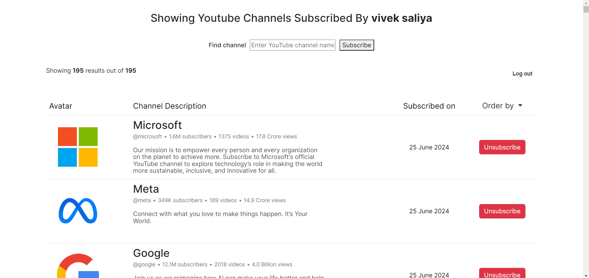

# YouTube Subscription Manager

## Overview
The YouTube Subscription Manager is a web application that allows users to view and manage their YouTube channel subscriptions. Users can search for channels, sort their subscriptions, unsubscribe from channels, and subscribe to new ones directly from the interface.

## Features
unticked boxes shows *feature to be built in the future* 
- [x] **View Subscriptions**: Display a list of YouTube channels the user is subscribed to.
- [x] **Sort Subscriptions**: Sort subscriptions by alphabetical order, relevance, or activity.
- [x] **Search Channels**: Search for YouTube channels by name or ID.
- [x] **Unsubscribe**: Unsubscribe from channels.
- [ ] **Subscribe**: Subscribe to new channels.
- [ ] **Pagination**: Load more subscriptions dynamically.

## Technologies Used
- **Backend**: Node.js, Express.js
- **Frontend**: EJS (Embedded JavaScript), Bootstrap
- **YouTube Data API**: To fetch subscription data

## Prerequisites
- Node.js (version 14.x or higher)
- npm (Node Package Manager)

## Screenshots

### Landing Page


### Sign in with Google


### Subscription List


## Installation

1. Clone the repository:
   
   ```bash
   git clone https://github.com/saliyavivek/youtube-subscription-manager.git

2. Install dependencies:
   
   ```bash
   cd youtube-subscription-manager
   npm install
   
## Usage

### Set up your Google API credentials:

1. Create a project on the Google Developer Console.
2. Enable the YouTube Data API v3.
3. Create OAuth 2.0 credentials and download the JSON file.
4. Place the JSON file in your project directory and rename it to `credentials.json`.

## Contributing

Contributions are welcome! Please feel free to submit a Pull Request.
